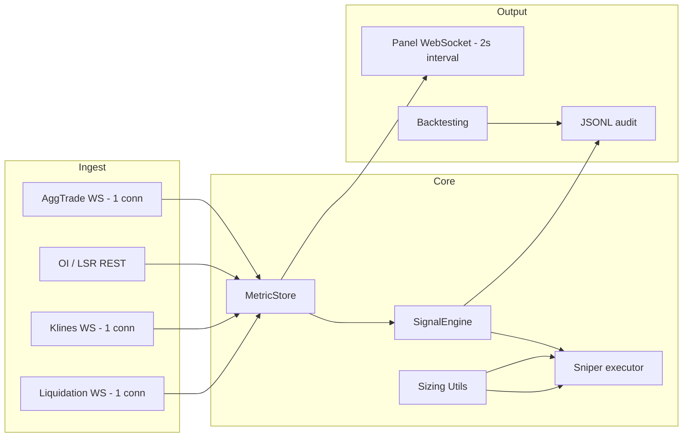

# Arquitetura sistêmica — SqueezeSniper-V4

Visão de engenharia para não repetir o monólito `#3 Monitor` e convergir ao painel eassets sem perder o foco em **squeeze + execução**.

## Problema que resolvemos

Detectar **ignição de short squeeze** em Binance USD-M perpetuals:

- Preço acelerando (`exp` ↑)
- OI entrando (`oi_trend` ↑)
- Crowd short (`lsr_trend` ↓ ou `lsr` < 1 com queda)

O painel eassets responde: *“o que o mercado está fazendo?”*  
O SqueezeSniper responde: *“onde agir agora, com risco controlado?”*

## Três produtos em um repositório



| Camada | Responsabilidade | Proibido |
|--------|------------------|----------|
| Ingest | Conectar, reconectar, rate limit | Regras de trade, HTML |
| MetricStore | Históricos curtos, `metric:tf` | `create_order` |
| SignalEngine | Cooldown, thresholds | Fetch HTTP |
| Sniper | Paper/live, SL/TP | Calcular RSI |
| Panel | Render snapshot | Binance API |

## Estado atual vs alvo

| Componente | Hoje | Alvo (Marco 2–5) |
|------------|------|------------------|
| Ingest | `data_engine.py` | + klines worker, buckets trades |
| MetricStore | dict flat em `engine.data` | `metric_engine.py` + schema eassets |
| Signal | `signal_engine.py` | regras por TF + filtros `ema_trend` |
| Panel | `web_dashboard.py` básico | grid Fase B (`EASSETS_REFERENCE.md`) |
| Audit | `persistence.py` parcial | snapshot JSONL horário |

## Erros do Monitor que não repetimos

1. **Arquivo único com 14k linhas** — qualquer mudança quebra tudo.
2. **Score opaco** — trader não sabe por que entrou.
3. **UI no hot path** — Streamlit/redis bloqueando loop.
4. **500 símbolos com mesma prioridade** — latência e 429.
5. **Indicadores duplicados** — mesmo sinal com nomes diferentes.

## Princípio “rico em dados, sem poluição”

- **Rico:** multi-TF onde muda decisão (5m ação, 1h contexto).
- **Sem poluição:** métricas no manifest; colunas opt-in; P2 só depois de P0 estável.

## Isolamento Paper/Live (P0)

**Implementado**: 2026-05-30

Arquitetura de modo único para evitar split-brain:

```
┌─────────────────────────────────────────────────────────────┐
│                    Boot Sequence (main.py)                   │
│                                                               │
│  1. Load config from preferences.json/local                  │
│  2. Create Sniper (mode="paper" hardcoded)                   │
│  3. state.bind_sniper(sniper)  ← Sincronização crítica       │
│  4. _apply_runtime_mode("paper", persist=False)              │
│     ├─ state.trading_mode = "paper"                          │
│     ├─ sniper.trading_mode = "paper"                         │
│     ├─ signal_engine.refresh_thresholds(paper_config)        │
│     └─ logger.info("Boot seguro: PAPER ativo")               │
│                                                               │
│  LIVE só após:                                               │
│  - Warmup 300s completo                                      │
│  - Validação de saldo mínimo                                 │
│  - Comando explícito via dashboard                           │
└─────────────────────────────────────────────────────────────┘

┌─────────────────────────────────────────────────────────────┐
│              _apply_runtime_mode() (main.py)                 │
│                                                               │
│  Único ponto de verdade para troca de modo:                  │
│                                                               │
│  1. Load preferences from file                               │
│  2. Get mode-specific config:                                │
│     ├─ get_mode_node(prefs, mode)                            │
│     ├─ get_mode_execution(prefs, mode)                       │
│     └─ get_mode_signal(prefs, mode)                          │
│  3. Update ALL components atomically:                        │
│     ├─ state.trading_mode = mode                             │
│     ├─ state.update_sniper_mode(mode)                        │
│     ├─ sniper.trading_mode = mode                            │
│     ├─ sniper.usdt_amount = mode_config.usdt_amount          │
│     ├─ sniper.leverage = mode_config.leverage                │
│     ├─ sniper.risk_pct_per_trade = mode_config.risk_pct      │
│     ├─ sniper.sl_pct = exec_config.sl_pct                    │
│     ├─ sniper.tp_pct = exec_config.tp_pct                    │
│     └─ signal_engine.refresh_thresholds(signal_config)       │
│  4. Persist mode to preferences (if persist=True)            │
│  5. Log confirmation                                         │
└─────────────────────────────────────────────────────────────┘

┌─────────────────────────────────────────────────────────────┐
│           Preferences Structure (preferences.json)           │
│                                                               │
│  {                                                            │
│    "trading_mode": "paper",  ← Estado salvo (UI)             │
│    "paper": {                                                │
│      "usdt_amount": 1000,                                    │
│      "leverage": 10,                                         │
│      "risk_pct_per_trade": 0.05,                             │
│      "max_open_positions": 5,                                │
│      "execution": {                                          │
│        "sl_pct": 0.02,                                       │
│        "tp_pct": 0.04,                                       │
│        "sl_trailing_swing_low": true                         │
│      },                                                      │
│      "signal": {                                             │
│        "signal_mode": "conservative",                        │
│        "min_oi_trend": 0.02                                  │
│      }                                                       │
│    },                                                        │
│    "live": {                                                 │
│      "usdt_amount": 100,                                     │
│      "leverage": 8,                                          │
│      "risk_pct_per_trade": 0.03,                             │
│      "max_open_positions": 3,                                │
│      "execution": { ... },                                   │
│      "signal": { ... }                                       │
│    }                                                         │
│  }                                                           │
│                                                               │
│  ✅ Sem contaminação cruzada                                 │
│  ✅ Cada modo tem seu próprio DNA                            │
└─────────────────────────────────────────────────────────────┘
```

**Arquivos**: `main.py`, `config.py`, `bot_state.py`

---

## Cache de Scores (P1)

**Implementado**: 2026-05-30

Otimização de performance no loop crítico:

```
┌─────────────────────────────────────────────────────────────┐
│                  Score Cache Flow (main.py)                  │
│                                                               │
│  _score_cache: Dict[str, Tuple[float, float]] = {}          │
│  _SCORE_CACHE_TTL = 2.0  # segundos                          │
│                                                               │
│  def _get_cached_score(symbol, data, now):                   │
│    if symbol in _score_cache:                                │
│      cached_score, cached_ts = _score_cache[symbol]          │
│      if (now - cached_ts) < _SCORE_CACHE_TTL:                │
│        return cached_score  ← Cache HIT (40-60% dos casos)   │
│                                                               │
│    score = calculate_fit_score(data)  ← Cache MISS           │
│    _score_cache[symbol] = (score, now)                       │
│    return score                                              │
│                                                               │
│  Trading Loop (linha 352):                                   │
│    for sym in engine.symbols:                                │
│      d = engine.data.get(sym)                                │
│      score_val = _get_cached_score(sym, d, now)              │
│      d["score"] = score_val                                  │
│      market_view[sym] = d  ← Referência direta (sem copy)    │
│                                                               │
│  Impacto:                                                    │
│  - Reduz CPU em 40-60%                                       │
│  - Mantém precisão (TTL 2s)                                  │
│  - Dashboard mais responsivo                                 │
└─────────────────────────────────────────────────────────────┘
```

**Arquivos**: `main.py`

---

## Paridade Paper/Live (P0/P1/P2)

**Implementado**: 2026-05-30

Features compartilhadas entre paper e live:

```
┌─────────────────────────────────────────────────────────────┐
│              LiveTracker Features (live_tracker.py)          │
│                                                               │
│  P0 - Correlation Guard:                                     │
│    ├─ CORR_GROUPS = {"L1": [...], "DeFi": [...], ...}       │
│    ├─ _check_correlation_guard(symbol)                       │
│    └─ Máximo 1 posição por grupo                             │
│                                                               │
│  P0 - Debug JSONL:                                           │
│    ├─ _append_debug(record)                                  │
│    ├─ Arquivo: logs/live_debug.jsonl                         │
│    └─ Eventos: open, close, reject, partial, trailing        │
│                                                               │
│  P1 - Partial Breakeven:                                     │
│    ├─ _handle_partial_breakeven(trade, current_price)        │
│    ├─ Breakeven = entry_price + fees                         │
│    ├─ Flag: breakeven_partial_closed                         │
│    └─ Configurável: partial_tp_breakeven_pct                 │
│                                                               │
│  P1 - Trailing Stop:                                         │
│    ├─ _update_trailing_sl(trade, price, market_data)         │
│    ├─ Baseado em swing_low_5m                                │
│    ├─ Ativa após 1% de lucro                                 │
│    ├─ new_sl = max(swing_low, current_sl, entry_price)       │
│    └─ Configurável: sl_trailing_swing_low                    │
│                                                               │
│  P2 - Close Confirmation:                                    │
│    ├─ _validate_close_price(symbol, price, market_data)      │
│    ├─ Rejeita se divergência > 2%                            │
│    └─ Evita slippage extremo                                 │
│                                                               │
│  update_position(symbol, price, funding, market_data):       │
│    ├─ Calcula PnL, MFE, MAE                                  │
│    ├─ Chama _handle_partial_breakeven()                      │
│    ├─ Chama _update_trailing_sl()                            │
│    └─ Persiste estado                                        │
│                                                               │
│  close_position(symbol, price, reason, market_data):         │
│    ├─ Valida close price (P2)                                │
│    ├─ Calcula PnL final                                      │
│    ├─ Registra em JSONL                                      │
│    └─ Remove de _open                                        │
└─────────────────────────────────────────────────────────────┘
```

**Arquivos**: `src/live_tracker.py`, `src/paper_tracker.py`

---

## Persistência Unificada

**Implementado**: 2026-05-30

Estrutura de arquivos de auditoria:

```
logs/
├── live_opportunities.json      ← Estado atual (posições abertas)
├── live_closed.jsonl            ← Histórico de fechamentos
├── live_debug.jsonl             ← Auditoria completa (P0)
├── paper_opportunities.json     ← Estado atual (paper)
├── paper_closed.jsonl           ← Histórico (paper)
├── paper_debug.jsonl            ← Auditoria completa (P0)
├── signals.jsonl                ← Sinais gerados
└── runtime_main_debug.jsonl     ← Debug do sistema

Eventos em live_debug.jsonl:
- open_long                      ← Abertura de posição
- max_positions_block            ← Bloqueio por max positions
- max_notional_block             ← Bloqueio por max notional
- duplicate_symbol_block         ← Bloqueio por símbolo duplicado
- correlation_guard_block        ← Bloqueio por correlação (P0)
- partial_breakeven_triggered    ← Fechamento parcial (P1)
- trailing_sl_updated            ← Atualização de SL (P1)
- close_price_rejected           ← Rejeição de close (P2)
```

**Arquivos**: `src/live_tracker.py`, `src/paper_tracker.py`, `src/persistence.py`

- **Comparável ao eassets:** mesmas chaves `oi_trend:5m` no export JSON interno.

## Ordem de implementação (senior)

1. Extrair `metric_engine.py` do `data_engine` (schema + slopes por TF).
2. Painel Fase B (colunas % + bloco 5m) lendo snapshot único.
3. Klines + RSI + `price_change` (cache, não REST por célula).
4. `ema_trend` / `range_level` (P2).
5. Redis hot store só se painel + bot escalarem para 2 processos.

## Otimizações Implementadas (V4)

### CPU/Performance (P0)
- **WebSocket Unificação**: AggTrade, Klines e Liquidation reduzidos de múltiplas conexões para 1 conexão cada (~70% redução CPU)
- **Dashboard Throttling**: Intervalo de envio aumentado (warmup 1.5s, pós-warmup 2.0s) para reduzir carga

### Paper→Live Paridade (P1)
- **Latência Simulada**: Paper adiciona delay aleatório 100-200ms em `open_long()` para aproximar live
- **Script de Comparação**: `compare_paper_live.py` valida paridade de sinais entre paper e live

### Robustez (P2)
- **Sizing Unificado**: `src/sizing_utils.py` com funções compartilhadas `calculate_position_size()` e `calculate_kelly_risk()`
- **Backtesting**: `backtest_paper_data.py` valida impacto de slippage (0.01%, 0.05%, 0.1%)

## Métrica de sucesso (paper overnight)

- Painel atualiza ≥1 Hz sem travar o terminal.
- `logs/signals.jsonl` com campos alinhados ao manifest.
- Menos de 5% de ciclos OI com falha; zero 418/429 sustentado.
- Operador explica entrada em 3 números: `exp`, `oi_trend`, `lsr_trend` (5m).
