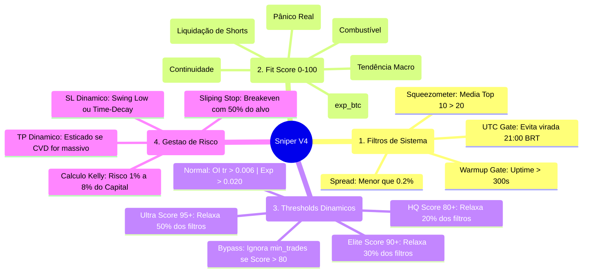

# DNA do Squeeze Sniper — Manifesto de Governança e Estratégia

Este documento define a lógica soberana do **SqueezeSniper V4**. O sistema opera como um **Funil de Governança**, onde cada etapa filtra o ruído do mercado até que reste apenas a "ignição pura" (entrada institucional agressiva).

## 🧠 Mapa Mental: Anatomia de um Trade

---

## 🛠 Detalhamento dos Critérios (Regras de Ouro)

### 1. O Filtro de Qualidade (O Funil)
Antes de analisar os números decimais, o Sniper valida a integridade do ativo:
*   **Status High Quality (HQ):** Se o `Fit Score` for >= 80, o bot entende que o alinhamento institucional é forte o suficiente para ser menos exigente com a inclinação exata.
*   **Atividade Real:** Ativos normais exigem pelo menos **5 trades por minuto**. Ativos HQ/Elite ignoram esse filtro (Bypass) para capturar ignições em ativos de baixa liquidez que estão sendo "acordados" por baleias.

### 2. Os Números do Gatilho (Janela 5m)
Para disparar o **SQUEEZE IGNITION**, os três pilares abaixo devem bater simultaneamente:

1.  **Momentum (Preço):** `exp:5m` >= **0.020**. Prova que o preço está acelerando em curva exponencial.
2.  **Combustível (Open Interest):** `oi_trend:5m` >= **0.006**. Garante que o movimento é causado por dinheiro novo entrando, não apenas realização de lucro.
3.  **Pânico (LSR):** `lsr_trend:5m` <= **-0.01** E `lsr_change_pct:5m` negativo. Confirma que os "amadores" (vendedores) estão sendo esmagados enquanto o preço sobe.

> **Nota sobre Relaxamento:** Ativos **Ultra Elite (Score 95+)** podem disparar com apenas 50% desses valores (ex: Exp 0.010 e OI 0.003), pois o alinhamento de outros indicadores (CVD, RSI, EMA) compensa a inclinação menor.

### 3. A "Paciência" do Sniper
*   **Sem Quarentena de Recusa:** O bot avalia o mercado em tempo real. Se uma moeda for recusada agora, mas os números baterem daqui a 1 segundo, o Sniper atira imediatamente.
*   **Warmup Gate:** Nos primeiros 300 segundos de vida do bot, nenhum trade é aberto para garantir que os indicadores de tendência (*slopes*) estejam maduros e estáveis.
*   **Cooldown:** Após fechar um trade, o ativo fica bloqueado (configurado em `signal.cooldown_seconds`) para evitar entradas repetidas no topo de uma exaustão.

### 4. Proteção de Capital e Precisão (Sliping-Stop)
O Sniper nunca dorme após a entrada:
*   **Risco Zero (Breakeven):** Se o lucro atingir o threshold dinâmico (default 70% do alvo), o Stop Loss é movido para o preço de entrada (+0.1%).
*   **Realização Parcial:** No momento do Risco Zero, **25% da posição** é fechada a mercado para garantir lucro realizado.
*   **Trailing Swing Low:** O SL persegue o fundo dos últimos 5 minutos, protegendo o lucro caso a tendência mude bruscamente.
*   **Precisão Quantitativa:** Todos os cálculos operam com **8 casas decimais** para garantir paridade total com o saldo real da Binance, descontando Taxas (Maker/Taker) e Funding Rates.
*   **Protocolo de Inicialização:** O sistema inicia obrigatoriamente em modo PAPER (Safe-Boot). A transição para LIVE exige validação de saldo em runtime e ação explícita do operador via Cockpit.

---

## 🏁 Resumo para o Operador

O critério atual foca em **"Pegar carona com as baleias"**. 
*   **Score Alto:** O bot assume o papel de caçador agressivo.
*   **Score Baixo:** O bot assume o papel de auditor conservador, exigindo perfeição matemática.
*   **Bias Diário:** A coluna **24h %** no dashboard serve como bússola de contexto (Bullish/Bearish Bias).
*   **Visibilidade:** O Dashboard oculta ativos com Score < 50 para garantir foco total na zona de ignição.

---
*Documento gerado automaticamente pela Governança SqueezeSniper V4.*